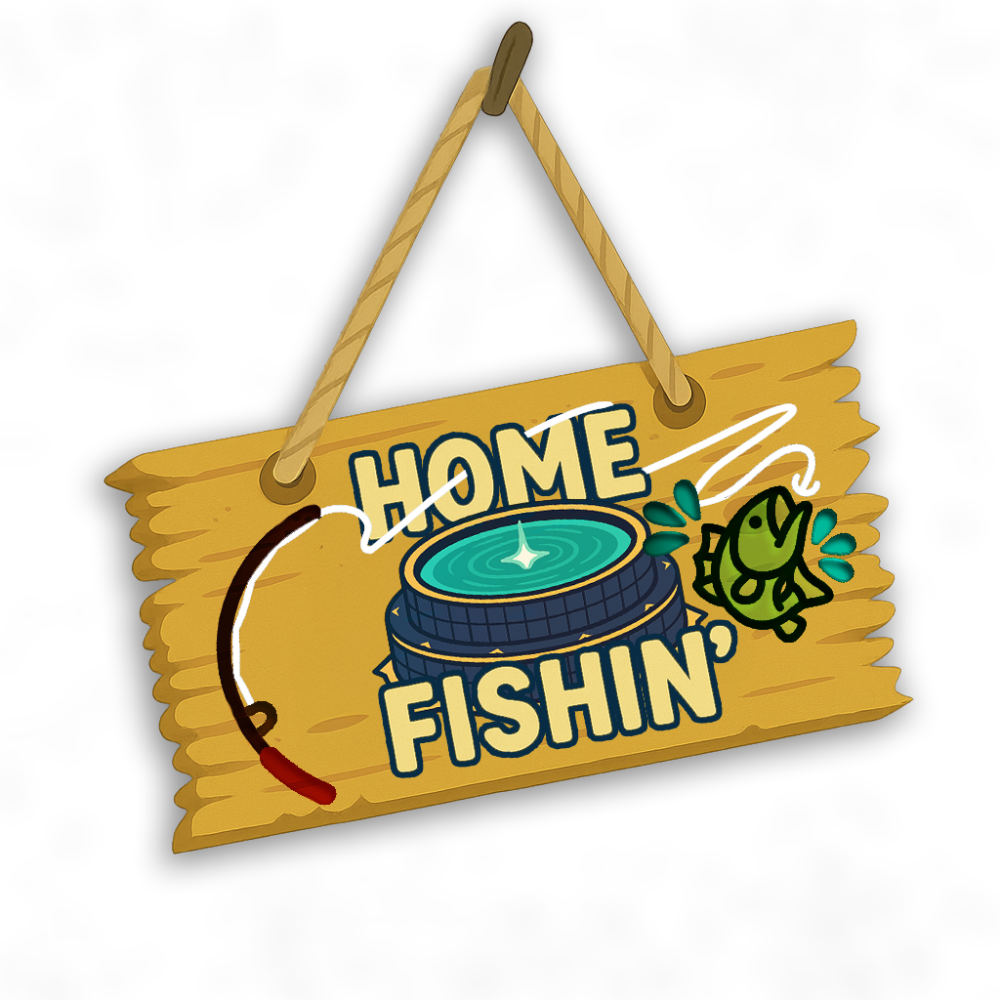

# KinPonds for V Rising
KinPonds is a fishing enhancement mod for V Rising that allows players to transform decorative pools into functional fishing ponds. Create your own fishing spots and customize the fishing experience on your server.

---

Thanks to the V Rising modding and server communities for ideas and requests!
Feel free to reach out to me on discord (odjit) if you have any questions or need help with the mod.

[V Rising Modding Discord](https://vrisingmods.com/discord)

## Features

- **Transform Pools into Ponds**: Convert decorative castle pools into functional fishing spots
- **Regional Fish Types**: Ponds automatically use region-appropriate fish based on their location
- **Customizable Drop Tables**: Admins can set custom loot tables for ponds
- **Configurable Costs**: Set item requirements for pond creation
- **Territory Limits**: Control how many ponds can exist per territory
- **Adjustable Respawn Rates**: Configure fish respawn timing

## Commands

### Player Commands
- `.pond`
  - Converts the nearest pool into a fishing pond. Must be standing near a decorative pool.
  - May require items if pond creation cost is configured by admin.
- `.pond respawn`
  - Shows current fish respawn time settings.

### Admin Commands
- `.pond respawn (minTime) (maxTime)`
  - Sets the minimum and maximum time between fish respawns in seconds.
- `.pond cost (item) (amount)`
  - Sets the item cost required to create a pond. Use item name or PrefabGUID.
  - Example: `.pond cost Stone 10`
- `.pond cost clear`
  - Removes any item cost requirement for pond creation.
- `.pond limit`
  - Shows the current pond limit per territory.
- `.pond limit (number)`
  - Sets maximum ponds allowed per territory. Use -1 for unlimited.
- `.pond droptable (dropTable)`
  - Sets the global drop table used by all new ponds.
- `.pond droptable clear`
  - Clears the global drop table, reverting to regional defaults.
- `.pond setdrop (dropTable)`
  - Sets a custom drop table for the pond you're looking at.

## Configuration

Server admins can configure:
- **Pond Creation Cost**: Require specific items to create ponds
- **Territory Limits**: Maximum ponds per claimed territory
- **Fish Respawn Timing**: How quickly fish respawn in ponds
- **Custom Drop Tables**: Override default regional fish with custom loot

## Installation

1. Install [BepInEx for V Rising](https://wiki.vrisingmods.com/user/game_update.html)
2. Install [VampireCommandFramework](https://github.com/decaprime/VampireCommandFramework)
3. Place `KinPonds.dll` in your `BepInEx/plugins` folder
4. Restart your server

## Usage Tips

- Point at a decorative pool and use `.pond` to convert it
- Only pools from the Strongblade DLC can be converted to ponds
- Each territory has a configurable limit on pond count
- Fish will respawn automatically based on server settings
- Admins can customize what fish spawn in specific ponds

This mod is licensed under the AGPL-3.0 license.